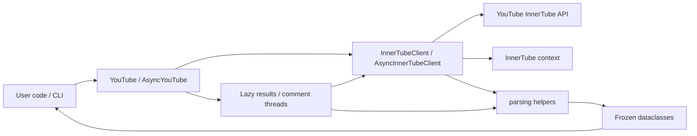

<p align="center">
  
  
</p>

# ytscrape — Free YouTube Scraper for Python

**Scrape YouTube search results, video & channel metadata, comments and
transcripts — no API key, no quota, no browser.**

[](https://pypi.org/project/ytscrape/)
[](https://pypi.org/project/ytscrape/)
[](https://pepy.tech/project/ytscrape)
[](LICENSE)
[](https://github.com/vsmutok/ytscrape/stargazers)

```python
from ytscrape import YouTube

with YouTube() as yt:
    for video in yt.search("python", max_results=5):
        print(video.title, video.url)
```

`ytscrape` talks to YouTube's internal *InnerTube* API — the same endpoints the
web app uses — and turns responses into **typed, frozen dataclasses** with
**transparent pagination**. Pure HTTP: no Selenium, no Playwright, no API key.
Sync (`YouTube`) and async (`AsyncYouTube`) share the same surface.

> ⚠️ This library uses YouTube's private endpoints. Use it responsibly and at
> your own risk — the endpoints may change over time.

## Why ytscrape?

- 🔑 **No API key, no quota** — nothing to register, no billing project.
- 🧊 **No browser** — pure HTTP only.
- 🧩 **Typed models** (`Video`, `Channel`, `Comment`, `Transcript`, …) + `py.typed`.
- 💬 **Every comment** — replies included; `CommentSort.NEWEST` does not hide any.
- 📄 **Transparent pagination** — just iterate; continuation tokens are handled for you.
- 🌍 **Localisation** — `language` (`hl`) and `region` (`gl`), validated ISO codes.
- ⚡ **Sync & async** — optional `httpx` extra for `AsyncYouTube`.
- 🖥️ **CLI included** — `ytscrape search "python" --max 10`.
- 📤 **JSON / CSV export** — `video.to_json()`, `dumps_csv(results)`, or
  `ytscrape search "python" --format json`.

## Installation

```bash
pip install ytscrape            # or: uv add ytscrape
pip install "ytscrape[async]"   # optional async API (httpx)
```

Requires **Python 3.10+**. Runtime deps: `requests`, `pycountry`, `defusedxml`
(+ `httpx` with the async extra).

## Quick start

```python
from ytscrape import YouTube, SearchFilter, CommentSort

with YouTube(language="en", region="US") as yt:
    for video in yt.search("python", filter=SearchFilter.VIDEOS, max_results=20):
        print(video.title, "-", video.url)

    details = yt.video("https://www.youtube.com/watch?v=dQw4w9WgXcQ")
    print(details.title, details.channel, details.views, details.length_seconds)

    for comment in yt.comments(
        "https://youtu.be/dQw4w9WgXcQ",
        include_replies=True,
        sort=CommentSort.NEWEST,
        max_results=100,
    ):
        marker = "  ↳" if comment.is_reply else "-"
        print(f"{marker} {comment.author}: {comment.text}")
```

Async (same methods, `await` / `async for`):

```python
import asyncio
from ytscrape import AsyncYouTube, SearchFilter


async def main() -> None:
    async with AsyncYouTube(max_concurrency=8) as yt:
        async for video in await yt.search(
            "python", filter=SearchFilter.VIDEOS, max_results=5
        ):
            print(video.title)


asyncio.run(main())
```

> 📂 Runnable **sync + async** snippets for every feature:
> [`examples/`](examples/) · full guides:
> [vsmutok.github.io/ytscrape](https://vsmutok.github.io/ytscrape/)

## Feature coverage

| Area | Status | Notes                                                  |
| ---- | :----: |--------------------------------------------------------|
| Search — videos / channels / playlists / Shorts / movies | ✅ | `SearchFilter.*`                                       |
| Video & channel metadata | ✅ | `video()`, `channel()` (id, URL, `@handle`)            |
| Comments + replies | ✅ | `comments()`, `CommentSort.NEWEST` for *every* comment |
| Transcripts / captions | ✅ | `transcript()` / `transcripts()`                       |
| Pagination | ✅ | Transparent for search and comments                    |
| Localisation (`hl` / `gl`) | ✅ | Validated ISO codes                                    |
| Typed models + `py.typed` | ✅ | PEP 561                                                |
| CLI | ✅ | `ytscrape` / `python -m ytscrape`                      |
| Async API | ✅ | `AsyncYouTube` via `ytscrape[async]`                   |
| Channel tabs, playlist items, related / trending | 🚧 | Planned                                                 |

## ytscrape vs. the alternatives

| | **ytscrape** | YouTube Data API | `yt-dlp` | Browser automation |
| ---------------------- | :----------: | :--------------: | :------: | :----------------: |
| API key required       |      ❌      |        ✅        |    ❌    |         ❌         |
| Daily quota            |      ❌      |        ✅        |    ❌    |         ❌         |
| Browser / driver needed|      ❌      |        ❌        |    ❌    |         ✅         |
| Search / metadata / comments | ✅ | ✅ | ✅ | ✅ |
| Typed Python models    |      ✅      |        ❌        |    ❌    |         ❌         |
| Async (`asyncio`) API  |      ✅      |        ❌        |    ❌    |       varies       |
| Downloads media        |      ❌      |        ❌        |    ✅    |         ✅         |
| Install size           |    tiny      |     medium       |  large   |       huge         |


## How it works

High-level flow — sync and async share the same models and parsing layer:



1. Load `youtube.com` once and extract the InnerTube **context** (API key, client version, visitor data).
2. POST to `youtubei/v1/search`, `player`, `browse`, `next`, etc. with that context.
3. Parse responses into frozen dataclasses; **continuation tokens** are followed while you iterate.

## Documentation

Deep dives live on the docs site (not duplicated here):

| Topic | Link |
| ----- | ---- |
| Installation | [docs](https://vsmutok.github.io/ytscrape/installation/) |
| Quickstart | [docs](https://vsmutok.github.io/ytscrape/quickstart/) |
| Search, details, comments, transcripts | [guides](https://vsmutok.github.io/ytscrape/guides/searching/) |
| Language & region, pagination, errors | [guides](https://vsmutok.github.io/ytscrape/guides/language-region/) |
| Async API (concurrency, retries, fan-out) | [async guide](https://vsmutok.github.io/ytscrape/guides/async/) |
| Proxies, custom sessions | [advanced](https://vsmutok.github.io/ytscrape/guides/advanced/) |
| CLI | [CLI overview](https://vsmutok.github.io/ytscrape/cli/overview/) |
| API reference | [API](https://vsmutok.github.io/ytscrape/api/youtube/) |
| Examples (sync + async) | [`examples/`](examples/) |

### CLI cheatsheet

<p align="center">
  
</p>

The CLI prints colourful boxed tables under a mini `▶ ytscrape` wordmark, with a
spinner while requests are in flight:

```bash
ytscrape search "python tutorial" --filter videos --max 10
ytscrape --language uk --region UA search "музика" --max 10
ytscrape video https://www.youtube.com/watch?v=dQw4w9WgXcQ
ytscrape channel @RickAstleyYT
ytscrape transcript dQw4w9WgXcQ --lang en
ytscrape comments https://youtu.be/dQw4w9WgXcQ --replies --sort newest --max 20
```

`python -m ytscrape …` works too. Pass `--max 0` to `comments` for no limit.

## FAQ

<details>
<summary><b>Do I need a YouTube Data API key?</b></summary>

No. `ytscrape` uses the same internal endpoints as the YouTube web app.
</details>

<details>
<summary><b>Why are some comments missing?</b></summary>

YouTube's default **"Top comments"** view hides less relevant comments and
"potential spam". Pass `sort="newest"` (or `CommentSort.NEWEST`) to collect every
comment.
</details>

<details>
<summary><b>Why is <code>like_count</code> <code>None</code>?</b></summary>

YouTube abbreviates large counts (`1.2K`). The raw string is always in
`like_count_text`.
</details>

<details>
<summary><b>Can I use a proxy?</b></summary>

Yes — inject your own `requests.Session` into `InnerTubeClient`, or
`httpx.AsyncClient` into `AsyncInnerTubeClient`. See the
[advanced guide](https://vsmutok.github.io/ytscrape/guides/advanced/).
</details>

<details>
<summary><b>Will I get rate limited?</b></summary>

There is no published quota, but YouTube may throttle aggressive traffic. Reuse
one client, cap work with `max_results`, and add delays for large crawls.
</details>

<details>
<summary><b>Does it download videos?</b></summary>

No — metadata only. Use [`yt-dlp`](https://github.com/yt-dlp/yt-dlp) for media.
</details>

<details>
<summary><b>Is scraping YouTube legal?</b></summary>

Private endpoints may conflict with YouTube's Terms of Service. The library is
for research and educational use; you are responsible for how you use it.
</details>

## Contributing

Bug reports, ideas and PRs are welcome — see [CONTRIBUTING.md](CONTRIBUTING.md).

```bash
git clone https://github.com/vsmutok/ytscrape && cd ytscrape
uv sync --dev
uv run pytest
uv run pre-commit run --all-files
```

- 🗺️ todo: [todo.md](todo.md)
- 📝 Changelog: [CHANGELOG.md](CHANGELOG.md)

## License

[MIT](LICENSE)
