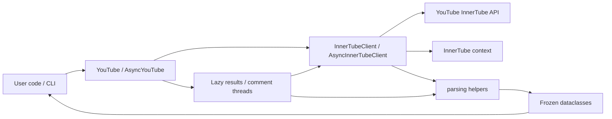

<p align="center">
  
  
</p>

# ytscrape — YouTube Scraper for Python (No API Key)

**The fast, free, open-source Python YouTube scraper. Scrape YouTube search
results, video metadata, channel info, comments, replies and transcripts —
no API key, no quota, no Selenium, no browser.**

[](https://github.com/vsmutok/ytscrape/actions/workflows/tests.yml)
[](https://codecov.io/gh/vsmutok/ytscrape)
[](https://pypi.org/project/ytscrape/)
[](https://pypi.org/project/ytscrape/)
[](https://pepy.tech/project/ytscrape)
[](LICENSE)
[](https://github.com/vsmutok/ytscrape/stargazers)
[](https://vsmutok.github.io/ytscrape/)

<p align="center">
  <a href="#installation">Installation</a> •
  <a href="#quick-start">Quick start</a> •
  <a href="#what-can-you-scrape-from-youtube">Features</a> •
  <a href="#use-cases">Use cases</a> •
  <a href="#ytscrape-vs-the-alternatives">Comparison</a> •
  <a href="#faq">FAQ</a> •
  <a href="https://vsmutok.github.io/ytscrape/">Docs</a>
</p>

> ⭐ **If ytscrape saves you time, please star the repo** — it helps other
> developers searching for a *YouTube scraper* find it.

```python
from ytscrape import YouTube

with YouTube() as yt:
    for video in yt.search("python", max_results=5):
        print(video.title, video.url)
```

`ytscrape` talks to YouTube's internal *InnerTube* API — the same endpoints the
web app uses — and turns responses into **typed, frozen dataclasses** with
**transparent pagination**. Pure HTTP: no Selenium, no Playwright, no API key.
Sync (`YouTube`) and async (`AsyncYouTube`) share the same surface.

> ⚠️ This library uses YouTube's private endpoints. Use it responsibly and at
> your own risk — the endpoints may change over time.

## CLI demo

<p align="center">
  
</p>

The CLI prints colourful boxed tables under a mini `▶ ytscrape` wordmark, with a
spinner while requests are in flight:

```bash
ytscrape search "python tutorial" --filter videos --max 10
ytscrape video https://www.youtube.com/watch?v=dQw4w9WgXcQ
ytscrape channel @RickAstleyYT
ytscrape comments https://youtu.be/dQw4w9WgXcQ --replies --sort newest --max 20
```

`python -m ytscrape …` works too. See the [full CLI guide](https://vsmutok.github.io/ytscrape/cli/overview/) for more.

## What can you scrape from YouTube?

| Data | Method | CLI |
| ---- | ------ | --- |
| 🔎 YouTube search results (videos, channels, playlists, Shorts, movies) | `yt.search()` | `ytscrape search` |
| 🎬 Video metadata (title, channel, views, duration, description) | `yt.video()` | `ytscrape video` |
| 📺 Channel info (subscribers, handle, links, join date) | `yt.channel()` | `ytscrape channel` |
| 💬 Comments **and replies** (every comment, not only "Top") | `yt.comments()` | `ytscrape comments` |
| 📝 Transcripts / subtitles / captions | `yt.transcript()` | `ytscrape transcript` |

Export everything to **JSON or CSV** in one line.

## Why ytscrape?

- 🔑 **No API key, no quota** — nothing to register, no billing project.
- 🧊 **No browser** — pure HTTP only.
- 🧩 **Typed models** (`Video`, `Channel`, `Comment`, `Transcript`, …) + `py.typed`.
- 💬 **Every comment** — replies included; `CommentSort.NEWEST` does not hide any.
- 📄 **Transparent pagination** — just iterate; continuation tokens are handled for you.
- 🌍 **Localisation** — `language` (`hl`) and `region` (`gl`), validated ISO codes.
- ⚡ **Sync & async** — optional `httpx` extra for `AsyncYouTube`.
- 🖥️ **CLI included** — `ytscrape search "python" --max 10`.
- 📤 **JSON / CSV export** — `video.to_json()`, `dumps_csv(results)`, or
  `ytscrape search "python" --format json`.

## Use cases

- 📊 **Data science & research** — build YouTube datasets for analysis.
- 🤖 **AI / LLM / RAG pipelines** — pull YouTube transcripts as training or retrieval data.
- 💬 **Sentiment analysis** — scrape YouTube comments at scale.
- 📈 **SEO & marketing** — keyword research, competitor channel monitoring.
- 🧪 **Academic studies** — reproducible collection of video & channel metadata.
- 🛠️ **Bots & automations** — lightweight alternative to the YouTube Data API v3.

## Installation

```bash
pip install ytscrape            # or: uv add ytscrape
pip install "ytscrape[async]"   # optional async API (httpx)
```

Requires **Python 3.10+**. Runtime deps: `requests`, `pycountry`, `defusedxml`
(+ `httpx` with the async extra).

## Quick start

```python
from ytscrape import YouTube, SearchFilter, CommentSort

with YouTube(language="en", region="US") as yt:
    for video in yt.search("python", filter=SearchFilter.VIDEOS, max_results=20):
        print(video.title, "-", video.url)

    details = yt.video("https://www.youtube.com/watch?v=dQw4w9WgXcQ")
    print(details.title, details.channel, details.views, details.length_seconds)

    for comment in yt.comments(
        "https://youtu.be/dQw4w9WgXcQ",
        include_replies=True,
        sort=CommentSort.NEWEST,
        max_results=100,
    ):
        marker = "  ↳" if comment.is_reply else "-"
        print(f"{marker} {comment.author}: {comment.text}")
```

Async (same methods, `await` / `async for`):

```python
import asyncio
from ytscrape import AsyncYouTube, SearchFilter


async def main() -> None:
    async with AsyncYouTube(max_concurrency=8) as yt:
        async for video in await yt.search(
            "python", filter=SearchFilter.VIDEOS, max_results=5
        ):
            print(video.title)


asyncio.run(main())
```

> 📂 Runnable **sync + async** snippets for every feature:
> [`examples/`](examples/) · full guides:
> [vsmutok.github.io/ytscrape](https://vsmutok.github.io/ytscrape/)

## Feature coverage

| Area | Status | Notes                                                  |
| ---- | :----: |--------------------------------------------------------|
| Search — videos / channels / playlists / Shorts / movies | ✅ | `SearchFilter.*`                                       |
| Video & channel metadata | ✅ | `video()`, `channel()` (id, URL, `@handle`)            |
| Comments + replies | ✅ | `comments()`, `CommentSort.NEWEST` for *every* comment |
| Transcripts / captions | ✅ | `transcript()` / `transcripts()`                       |
| Pagination | ✅ | Transparent for search and comments                    |
| Localisation (`hl` / `gl`) | ✅ | Validated ISO codes                                    |
| Typed models + `py.typed` | ✅ | PEP 561                                                |
| CLI | ✅ | `ytscrape` / `python -m ytscrape`                      |
| Async API | ✅ | `AsyncYouTube` via `ytscrape[async]`                   |
| Channel videos tab (`yt.channel_videos()`) | ✅ | Lazy pagination                                        |
| Retries, backoff, rate limiting, bot detection | ✅ | `RetryPolicy`, `RateLimiter`, `min_interval`           |
| Other channel tabs, playlist items, related / trending | 🚧 | Planned                                                 |

## ytscrape vs. the alternatives

See the [**Migration Guide from scrapetube**](MIGRATION_FROM_SCRAPETUBE.md) for a detailed comparison and code examples.

| | **ytscrape** | `scrapetube` | YouTube Data API | `yt-dlp` | Browser automation |
| ---------------------- | :----------: | :----------: | :--------------: | :------: | :----------------: |
| API key required       |      ❌      |      ❌      |        ✅        |    ❌    |         ❌         |
| Comments & Replies     |      ✅      |      ❌      |        ✅        |    ✅    |         ✅         |
| Transcripts / Captions |      ✅      |      ❌      |        ✅        |    ✅    |         ✅         |
| Typed Python models    |      ✅      |      ❌      |        ❌        |    ❌    |         ❌         |
| Async (`asyncio`) API  |      ✅      |      ❌      |        ❌        |    ❌    |       varies       |
| Metadata (views, date) |      ✅      |   partial    |        ✅        |    ✅    |         ✅         |
| Browser needed         |      ❌      |      ❌      |        ❌        |    ❌    |         ✅         |
| Install size           |    tiny      |     tiny     |     medium       |  large   |       huge         |


## How it works

High-level flow — sync and async share the same models and parsing layer:


```mermaid
graph LR
    User[User code / CLI] --> Facade[YouTube / AsyncYouTube]
    Facade --> Client[InnerTubeClient / AsyncInnerTubeClient]
    Facade --> Results[Lazy results / comment threads]
    Client --> InnerTube[YouTube InnerTube API]
    Client --> Context[InnerTube context]
    Results --> Client
    Client --> Parsing[parsing helpers]
    Results --> Parsing
    Parsing --> Models[Frozen dataclasses]
    Models --> User
```

1. Load `youtube.com` once and extract the InnerTube **context** (API key, client version, visitor data).
2. POST to `youtubei/v1/search`, `player`, `browse`, `next`, etc. with that context.
3. Parse responses into frozen dataclasses; **continuation tokens** are followed while you iterate.

## Documentation

Deep dives live on the docs site (not duplicated here):

| Topic | Link |
| ----- | ---- |
| Installation | [docs](https://vsmutok.github.io/ytscrape/installation/) |
| Quickstart | [docs](https://vsmutok.github.io/ytscrape/quickstart/) |
| Search, details, comments, transcripts | [guides](https://vsmutok.github.io/ytscrape/guides/searching/) |
| Language & region, pagination, errors | [guides](https://vsmutok.github.io/ytscrape/guides/language-region/) |
| Async API (concurrency, retries, fan-out) | [async guide](https://vsmutok.github.io/ytscrape/guides/async/) |
| Proxies, custom sessions | [advanced](https://vsmutok.github.io/ytscrape/guides/advanced/) |
| CLI | [CLI overview](https://vsmutok.github.io/ytscrape/cli/overview/) |
| API reference | [API](https://vsmutok.github.io/ytscrape/api/youtube/) |
| Examples (sync + async) | [`examples/`](examples/) |


## FAQ

<details>
<summary><b>Do I need a YouTube Data API key?</b></summary>

No. `ytscrape` uses the same internal endpoints as the YouTube web app.
</details>

<details>
<summary><b>Why are some comments missing?</b></summary>

YouTube's default **"Top comments"** view hides less relevant comments and
"potential spam". Pass `sort="newest"` (or `CommentSort.NEWEST`) to collect every
comment.
</details>

<details>
<summary><b>Why is <code>like_count</code> <code>None</code>?</b></summary>

YouTube abbreviates large counts (`1.2K`). The raw string is always in
`like_count_text`.
</details>

<details>
<summary><b>Can I use a proxy?</b></summary>

Yes — inject your own `requests.Session` into `InnerTubeClient`, or
`httpx.AsyncClient` into `AsyncInnerTubeClient`. See the
[advanced guide](https://vsmutok.github.io/ytscrape/guides/advanced/).
</details>

<details>
<summary><b>Will I get rate limited?</b></summary>

There is no published quota, but YouTube may throttle aggressive traffic. Reuse
one client, cap work with `max_results`, and add delays for large crawls.
</details>

<details>
<summary><b>Does it download videos?</b></summary>

No — metadata only. Use [`yt-dlp`](https://github.com/yt-dlp/yt-dlp) for media.
</details>

<details>
<summary><b>Is scraping YouTube legal?</b></summary>

Private endpoints may conflict with YouTube's Terms of Service. The library is
for research and educational use; you are responsible for how you use it.
</details>

## Contributing

Bug reports, ideas and PRs are welcome — see [CONTRIBUTING.md](CONTRIBUTING.md).

```bash
git clone https://github.com/vsmutok/ytscrape && cd ytscrape
uv sync --dev
uv run pytest
uv run pre-commit run --all-files
```

- 🗺️ todo: [todo.md](todo.md)
- 📝 Changelog: [CHANGELOG.md](CHANGELOG.md)

## Star History

<a href="https://www.star-history.com/?repos=vsmutok%2Fytscrape&type=date&legend=top-left">
 <picture>
   <source media="(prefers-color-scheme: dark)" srcset="https://api.star-history.com/chart?repos=vsmutok/ytscrape&type=date&theme=dark&legend=top-left" />
   <source media="(prefers-color-scheme: light)" srcset="https://api.star-history.com/chart?repos=vsmutok/ytscrape&type=date&legend=top-left" />
   
 </picture>
</a>

## License

[MIT](LICENSE) — free for personal and commercial use.

---

<sub>**Keywords:** youtube scraper, python youtube scraper, scrape youtube,
youtube scraping, youtube comments scraper, youtube transcript downloader,
youtube search api python, youtube data api alternative, youtube api without
key, innertube api, youtube metadata extractor, youtube channel scraper,
youtube crawler, youtube shorts scraper, async youtube scraper, scrapetube alternative.</sub>
